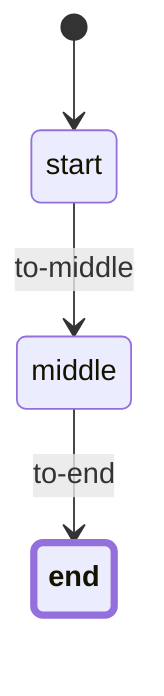

# Go Workflow

A flexible and extensible workflow engine for Go applications. This package provides a robust implementation of a Petri net-based workflow system that supports complex state transitions, event handling, and constraints. Inspired by [Symfony Workflow Component](https://symfony.com/doc/current/workflow.html).

## Features

- Petri net-based workflow engine
- Support for multiple states and transitions
- Event system for workflow lifecycle hooks
- Constraint system for transition validation
- Thread-safe workflow registry
- Comprehensive test coverage
- Mermaid diagram generation for visualization
- **Flexible, context-aware storage interface for workflow persistence**
- **Options pattern for custom fields and schema generation**
- **Reusable, pluggable history/audit layer with pagination and filtering**
- Workflow manager for lifecycle management
- Support for parallel transitions and branching

## Storage Layer (New)

The storage layer is now fully context-aware and supports custom fields via the options pattern. Only fields declared as custom fields are persisted.

### Storage Interface

The package provides a flexible, context-aware storage interface for persisting workflow states and custom fields:

```go
type Storage interface {
    LoadState(id string) (places []Place, context map[string]interface{}, err error)
    SaveState(id string, places []Place, context map[string]interface{}) error
    DeleteState(id string) error
}
```

You can implement your own storage backend by implementing this interface. The package includes a SQLite implementation with options for custom fields:

```go
import "github.com/ehabterra/workflow/storage"

// Create a SQLite storage with custom fields
storage, err := storage.NewSQLiteStorage(db,
    storage.WithTable("workflow_states"),
    storage.WithCustomFields(map[string]string{
        "title": "title TEXT",
        "owner": "owner TEXT",
    }),
)
if err != nil { panic(err) }

// Generate and initialize schema
schema := storage.GenerateSchema()
if err := storage.Initialize(db, schema); err != nil { panic(err) }

// Save state with context
err = storage.SaveState("my-workflow", []workflow.Place{"draft"}, map[string]interface{}{"title": "My Doc", "owner": "alice"})

// Load state and context
places, ctx, err := storage.LoadState("my-workflow")
fmt.Println(places, ctx["title"], ctx["owner"])
```

## History Layer (New)

The history layer is reusable, pluggable, and supports custom fields, pagination, and filtering.

### History Interface

```go
type HistoryStore interface {
    SaveTransition(record *TransitionRecord) error
    ListHistory(workflowID string, opts QueryOptions) ([]TransitionRecord, error)
    GenerateSchema() string
    Initialize() error
}
```

### SQLite History Example

```go
import "github.com/ehabterra/workflow/history"

historyStore := history.NewSQLiteHistory(db,
    history.WithCustomFields(map[string]string{
        "ip_address": "ip_address TEXT",
    }),
)
historyStore.Initialize()

// Save a transition with custom fields
historyStore.SaveTransition(&history.TransitionRecord{
    WorkflowID: "wf1",
    FromState:  "draft",
    ToState:    "review",
    Transition: "submit",
    Notes:      "Submitted for review",
    Actor:      "alice",
    CreatedAt:  time.Now(),
    CustomFields: map[string]interface{}{
        "ip_address": "127.0.0.1",
    },
})

// List history with pagination
records, err := historyStore.ListHistory("wf1", history.QueryOptions{Limit: 10, Offset: 0})
for _, rec := range records {
    fmt.Println(rec.FromState, rec.ToState, rec.Notes, rec.CustomFields["ip_address"])
}
```

## Feature Checklist

### Current Features ✅
- [x] Basic workflow definition and execution
- [x] Multiple states and transitions
- [x] Event system for workflow hooks
- [x] Constraint system for transitions
- [x] Thread-safe workflow registry
- [x] Mermaid diagram visualization
- [x] Workflow manager for lifecycle management
- [x] Storage interface for persistence
- [x] SQLite storage implementation
- [x] Support for parallel transitions and branching
- [x] Workflow history and audit trail (in examples)
- [x] Web interface for workflow management (in examples)
- [x] REST API endpoints (in examples)

### Planned Features 🚀

#### High Priority
- [ ] YAML/JSON configuration support
- [ ] Standalone web interface for workflow management
- [ ] Enhanced REST API endpoints
- [ ] Workflow validation system
- [ ] Dynamic workflow definition loading

#### Medium Priority
- [ ] Custom scripting for transition conditions
- [ ] Workflow versioning
- [ ] Workflow templates
- [ ] Role-based access control
- [ ] Workflow timeout and scheduling

#### Low Priority
- [ ] Workflow statistics and analytics
- [ ] Export/Import workflow definitions

## Installation

```bash
go get github.com/ehabterra/workflow
```

## Quick Start

Here's a simple example of how to use the workflow package with the new context-aware storage and options pattern:

```go
package main

import (
    "database/sql"
    "fmt"
    "time"

    "github.com/ehabterra/workflow"
    "github.com/ehabterra/workflow/storage"
    _ "github.com/mattn/go-sqlite3"
)

func main() {
    // Open SQLite DB (in-memory for demo)
    db, err := sql.Open("sqlite3", ":memory:")
    if err != nil { panic(err) }

    // Create storage with custom fields
    store, err := storage.NewSQLiteStorage(db,
        storage.WithTable("workflow_states"),
        storage.WithCustomFields(map[string]string{
            "title": "title TEXT",
        }),
    )
    if err != nil { panic(err) }
    if err := storage.Initialize(db, store.GenerateSchema()); err != nil { panic(err) }

    // Define workflow
    definition, err := workflow.NewDefinition(
        []workflow.Place{"start", "middle", "end"},
        []workflow.Transition{
            *workflow.MustNewTransition("to-middle", []workflow.Place{"start"}, []workflow.Place{"middle"}),
            *workflow.MustNewTransition("to-end", []workflow.Place{"middle"}, []workflow.Place{"end"}),
        },
    )
    if err != nil { panic(err) }

    // Create manager
    registry := workflow.NewRegistry()
    manager := workflow.NewManager(registry, store)

    // Create a new workflow with context
    wf, err := manager.CreateWorkflow("my-workflow", definition, "start")
    if err != nil { panic(err) }
    wf.SetContext("title", "My Example Workflow")
    if err := manager.SaveWorkflow("my-workflow", wf); err != nil { panic(err) }

    // Apply a transition
    err = wf.Apply([]workflow.Place{"middle"})
    if err != nil { panic(err) }
    if err := manager.SaveWorkflow("my-workflow", wf); err != nil { panic(err) }

    // Load workflow and context from storage
    loadedPlaces, loadedCtx, err := store.LoadState("my-workflow")
    if err != nil { panic(err) }
    fmt.Printf("Current places: %v, Title: %v\n", loadedPlaces, loadedCtx["title"])

    // Generate and print the workflow diagram
    diagram := wf.Diagram()
    fmt.Println(diagram)
}
```

## Advanced Usage

### Using the Workflow Manager

The workflow manager provides a high-level interface for managing workflow lifecycles and persistence:

```go
// Create a registry and storage
registry := workflow.NewRegistry()
storage := workflow.NewSQLiteStorage("workflows.db")

// Create a workflow manager
manager := workflow.NewManager(registry, storage)

// Create a new workflow
wf, err := manager.CreateWorkflow("my-workflow", definition, "start")
if err != nil {
    panic(err)
}

// Get a workflow (loads from storage if not in registry)
wf, err = manager.GetWorkflow("my-workflow", definition)
if err != nil {
    panic(err)
}

// Save workflow state
err = manager.SaveWorkflow("my-workflow", wf)
if err != nil {
    panic(err)
}

// Delete a workflow
err = manager.DeleteWorkflow("my-workflow")
if err != nil {
    panic(err)
}
```

### Adding Constraints

You can add constraints to transitions to control when they can be applied:

```go
type MyConstraint struct{}

func (c *MyConstraint) Validate(event workflow.Event) error {
    // Add your validation logic here
    return nil
}

// Add the constraint to a transition
tr.AddConstraint(&MyConstraint{})
```

### Using the Registry

The registry allows you to manage multiple workflows and is **thread-safe** for concurrent access:

```go
registry := workflow.NewRegistry()

// Add a workflow
err := registry.AddWorkflow(wf)

// Get a workflow
wf, err := registry.Workflow("my-workflow")

// List all workflows
names := registry.ListWorkflows()

// Check if workflow exists
exists := registry.HasWorkflow("my-workflow")

// Remove a workflow
err = registry.RemoveWorkflow("my-workflow")
```

**Thread Safety**: The Registry is designed for concurrent access:
- ✅ **Read operations** (`Workflow`, `ListWorkflows`, `HasWorkflow`) use read locks for optimal performance
- ✅ **Write operations** (`AddWorkflow`, `RemoveWorkflow`) use write locks for data consistency
- ✅ **Concurrent reads and writes** are properly synchronized
- ✅ **Race condition free** - all operations are atomic

Example of concurrent usage:
```go
registry := workflow.NewRegistry()

// Multiple goroutines can safely access the registry
go func() {
    for i := 0; i < 100; i++ {
        wf := createWorkflow(fmt.Sprintf("workflow-%d", i))
        registry.AddWorkflow(wf)
    }
}()

go func() {
    for i := 0; i < 100; i++ {
        name := fmt.Sprintf("workflow-%d", i)
        wf, err := registry.Workflow(name)
        if err == nil {
            // Process workflow
        }
    }
}()

go func() {
    for i := 0; i < 100; i++ {
        names := registry.ListWorkflows()
        // Process workflow list
    }
}()
```

### Event Types

The workflow engine supports several event types:

- `EventBeforeTransition`: Fired before a transition is applied
- `EventAfterTransition`: Fired after a transition is applied
- `EventGuard`: Fired to check if a transition is allowed

### Context

You can attach context data to workflows:

```go
wf.SetContext("key", "value")
value, ok := wf.Context("key")
```

### Workflow Visualization

The package includes a Mermaid diagram generator for visualizing workflows. The generated diagrams can be rendered in any Mermaid-compatible viewer (like GitHub, GitLab, or the Mermaid Live Editor).

```go
// Generate a Mermaid diagram
diagram := wf.Diagram()
fmt.Println(diagram)
```

Example output:


## Benchmarks

The package includes benchmarks for common operations. Run them with:

```bash
go test -bench=. ./...
```

## Contributing

Contributions are welcome! Please feel free to submit a Pull Request.

## License

This project is licensed under the MIT License - see the LICENSE file for details. 