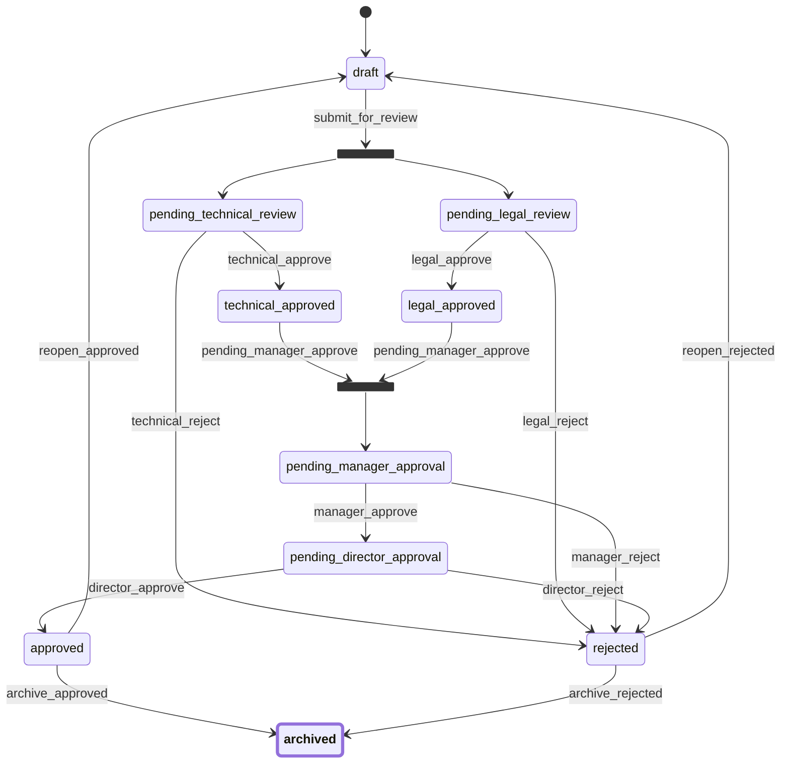

# Document Approval Workflow Example

This example demonstrates a document approval workflow using the workflow package. It shows how to implement a multi-step approval process for documents with different roles and permissions.

## Features

- Multi-step document approval process
- Role-based access control
- Workflow manager for lifecycle management
- Mermaid diagram visualization
- Event handling for workflow transitions
- Context data for document metadata

## Workflow States

The workflow consists of the following states:

1. **Draft**: Initial state for new documents
2. **Review**: Document is under review
3. **Approved**: Document has been approved
4. **Published**: Document is published
5. **Archived**: Document is archived

## Transitions

- `to_review`: Draft → Review
- `to_approved`: Review → Approved
- `to_published`: Approved → Published
- `to_archived`: Published → Archived
- `to_draft`: Review → Draft (rejection)

## Prerequisites

- Go 1.16 or later

## Installation

1. Clone the repository:
```bash
git clone https://github.com/ehabterra/workflow.git
cd workflow/examples/document_approval
```

2. Install dependencies:
```bash
go mod download
```

## Running the Example

```bash
go run main.go
```

## Implementation Details

### Workflow Definition

```go
// Create workflow definition
places := []workflow.Place{
    "draft",
    "review",
    "approved",
    "published",
    "archived",
}

transitions := []workflow.Transition{
    {
        Name: "to_review",
        From: []workflow.Place{"draft"},
        To:   []workflow.Place{"review"},
    },
    {
        Name: "to_approved",
        From: []workflow.Place{"review"},
        To:   []workflow.Place{"approved"},
    },
    {
        Name: "to_published",
        From: []workflow.Place{"approved"},
        To:   []workflow.Place{"published"},
    },
    {
        Name: "to_archived",
        From: []workflow.Place{"published"},
        To:   []workflow.Place{"archived"},
    },
    {
        Name: "to_draft",
        From: []workflow.Place{"review"},
        To:   []workflow.Place{"draft"},
    },
}

definition, err := workflow.NewDefinition(places, transitions)
```

### Workflow Manager

The example uses the workflow manager to handle workflow lifecycle:

```go
// Initialize the workflow manager
registry := workflow.NewRegistry()
storage := workflow.NewSQLiteStorage("document_approval.db")
manager := workflow.NewManager(registry, storage)

// Create a new workflow instance
wf, err := manager.CreateWorkflow("doc_1", definition, "draft")
if err != nil {
    // Handle error
}

// Get a workflow instance
wf, err = manager.GetWorkflow("doc_1", definition)
if err != nil {
    // Handle error
}

// Save workflow state
err = manager.SaveWorkflow("doc_1", wf)
if err != nil {
    // Handle error
}
```

### Event Handling

The example demonstrates how to use event listeners for workflow transitions:

```go
// Add event listener for before transition
wf.AddEventListener(workflow.EventBeforeTransition, func(event workflow.Event) error {
    fmt.Printf("Before transition: %s\n", event.Transition.Name)
    return nil
})

// Add event listener for after transition
wf.AddEventListener(workflow.EventAfterTransition, func(event workflow.Event) error {
    fmt.Printf("After transition: %s\n", event.Transition.Name)
    return nil
})

// Add guard event listener
wf.AddGuardEventListener(func(event *workflow.GuardEvent) error {
    // Add your validation logic here
    return nil
})
```

### Context Data

The example shows how to use context data for document metadata:

```go
// Set document metadata
wf.SetContext("title", "Sample Document")
wf.SetContext("author", "John Doe")
wf.SetContext("version", "1.0")

// Get document metadata
title, _ := wf.Context("title")
author, _ := wf.Context("author")
version, _ := wf.Context("version")
```

## Workflow Diagram

The workflow diagram is generated using Mermaid.js and shows the possible states and transitions:



## Testing

1. Create a new document
2. Try different transitions
3. Verify the state changes
4. Check event handling
5. View the workflow diagram

## Contributing

Feel free to submit issues and enhancement requests! 