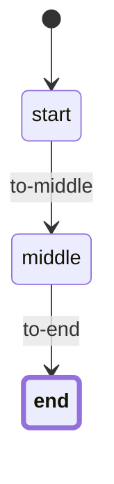

# Simple Flow Example

This example demonstrates a basic workflow using the workflow package. It shows the core concepts of the workflow engine with a simple state machine.

## Features

- Basic workflow definition
- Simple state transitions
- Workflow manager for lifecycle management
- Mermaid diagram visualization
- Event handling
- Context data

## Workflow States

The workflow consists of the following states:

1. **Start**: Initial state
2. **Middle**: Intermediate state
3. **End**: Final state

## Transitions

- `to_middle`: Start → Middle
- `to_end`: Middle → End

## Prerequisites

- Go 1.16 or later

## Installation

1. Clone the repository:
```bash
git clone https://github.com/ehabterra/workflow.git
cd workflow/examples/simple_flow
```

2. Install dependencies:
```bash
go mod download
```

## Running the Example

```bash
go run main.go
```

## Implementation Details

### Workflow Definition

```go
// Create workflow definition
places := []workflow.Place{
    "start",
    "middle",
    "end",
}

transitions := []workflow.Transition{
    {
        Name: "to_middle",
        From: []workflow.Place{"start"},
        To:   []workflow.Place{"middle"},
    },
    {
        Name: "to_end",
        From: []workflow.Place{"middle"},
        To:   []workflow.Place{"end"},
    },
}

definition, err := workflow.NewDefinition(places, transitions)
```

### Workflow Manager

The example uses the workflow manager to handle workflow lifecycle:

```go
// Initialize the workflow manager
registry := workflow.NewRegistry()
storage := workflow.NewSQLiteStorage("simple_flow.db")
manager := workflow.NewManager(registry, storage)

// Create a new workflow instance
wf, err := manager.CreateWorkflow("flow_1", definition, "start")
if err != nil {
    // Handle error
}

// Get a workflow instance
wf, err = manager.GetWorkflow("flow_1", definition)
if err != nil {
    // Handle error
}

// Save workflow state
err = manager.SaveWorkflow("flow_1", wf)
if err != nil {
    // Handle error
}
```

### Event Handling

The example demonstrates how to use event listeners for workflow transitions:

```go
// Add event listener for before transition
wf.AddEventListener(workflow.EventBeforeTransition, func(event workflow.Event) error {
    fmt.Printf("Before transition: %s\n", event.Transition.Name)
    return nil
})

// Add event listener for after transition
wf.AddEventListener(workflow.EventAfterTransition, func(event workflow.Event) error {
    fmt.Printf("After transition: %s\n", event.Transition.Name)
    return nil
})
```

### Context Data

The example shows how to use context data:

```go
// Set context data
wf.SetContext("step", 1)
wf.SetContext("timestamp", time.Now())

// Get context data
step, _ := wf.Context("step")
timestamp, _ := wf.Context("timestamp")
```

## Workflow Diagram

The workflow diagram is generated using Mermaid.js and shows the possible states and transitions:



## Testing

1. Create a new workflow instance
2. Try different transitions
3. Verify the state changes
4. Check event handling
5. View the workflow diagram

## Contributing

Feel free to submit issues and enhancement requests! 